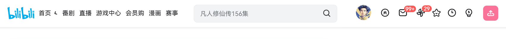
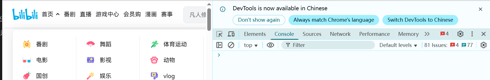
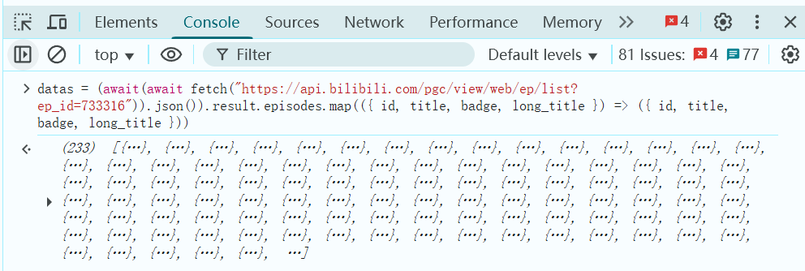
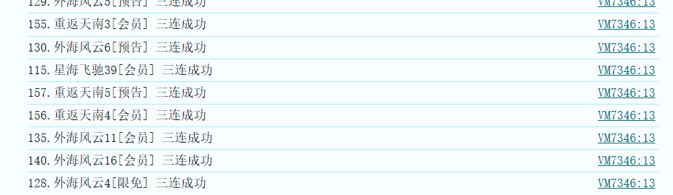

# 简介

因为加班没有第一时间看到韩道友结婴，但无伤大雅。

好的作品值得大家的肯定，在此开源一个能够查缺补漏一键三连的工具，大家给凡人制作组的经费上一波强度。

# 作用
扫描我们账号有哪一集没有三连，然后全部补上，这个文档类似于教程

# js 魔法
> 原本想直接用python+wasm直接做纯前端的傻瓜式请求应用的，但是想想容易被别人使用做坏事，还是纯js方便大伙审计


## 步骤一

> [凡人修仙传：第156话 重返天南4](https://www.bilibili.com/bangumi/play/ep1231564/?share_source=copy_web)

随便在浏览器播放任意一集B站的凡人修仙传，可以点击上面的链接跳转，如果没登录需要登录



！！！需要登录

## 步骤二

根据你的浏览器类型打开控制台（开发者工具里的console页面）

|浏览器|快捷键|
|-|-|
|chrome|`F12`或者`Ctrl+Shift+I`，也可以手动点击更多(三个点)->更多工具->开发者工具|
|其他请自行搜索方法||


## 步骤三 输入javascript脚本获取凡人剧集列表

```javascript
datas = (await(await fetch("https://api.bilibili.com/pgc/view/web/ep/list?ep_id=733316")).json()).result.episodes.map(({ id, title, badge, long_title }) => ({ id, title, badge, long_title }))
```


## 步骤四 获取每一集投币情况

> 可选 过滤预告，如果不想给预告投币先用 `datas=datas.filter(e=>e.badge!=="预告")` 把预告过滤掉
```javascript
infolist = await Promise.all(
    datas.map(async data => ({
        ...data,
        ...(await (await fetch(`https://api.bilibili.com/pgc/season/episode/web/info?ep_id=${data.id}`, {
            credentials: 'include'
        })).json()).data.user_community
    }))
);
```
## 可选 查看自己投币的 的剧集
```javascript
infolist.filter(info => info.coin_number > 0).map(info => `${info.title}.${info.long_title}${info.badge ? `[${info.badge}]` : ''} 点赞${info.like}投币${info.coin_number}收藏${info.favorite}`)
```
## 步骤五 筛选收集 自己未一键三连的剧集
```javascript
todolist=infolist.filter(({ like, coin_number, favorite}) => like == 0 ||coin_number == 0 || favorite == 0)
```

## 步骤六 全部补一键三连
```javascript
todolist.forEach(todo => {
  fetch('https://api.bilibili.com/pgc/season/episode/like/triple', {
    method: 'POST',
    credentials: 'include',
    headers: {
      'Content-Type': 'application/x-www-form-urlencoded'
    },
    body: `ep_id=${todo.id}&is_follow=0`
  })
    .then(response => response.json())
    .then(resData => {
      if (resData.code == 0) {
        console.log(`${todo.title}.${todo.long_title}${todo.badge ? `[${todo.badge}]` : ''} 三连成功`);
      } else {
        console.log(`${todo.title}.${todo.long_title}${todo.badge ? `[${todo.badge}]` : ''} 三连失败 ${JSON.stringify(resData)}`);
      }
    })
    .catch(error => console.error(`${todo.title} 请求失败:`, error));
});

```

## 效果 

